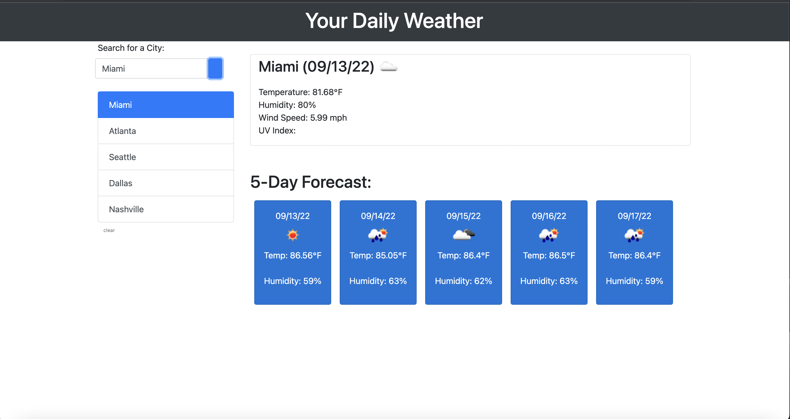

# Your-Daily-Weather

## Table of Contents
* General Info
* Technologies Used
* Screenshot
* Project Status
* Link to Deployed Application

## General Information
* Webpage created to see weather outlook for multiple cities.
* By using OpenWeatherMap API, the app presents a 5-day forecast for that city
* Past searched cities are stored in localStorage

## Technologies Used
* HTML
* CSS
* Javascript

## Screenshot

## Project Status
Project is: completed

## Link to Deployed Application
